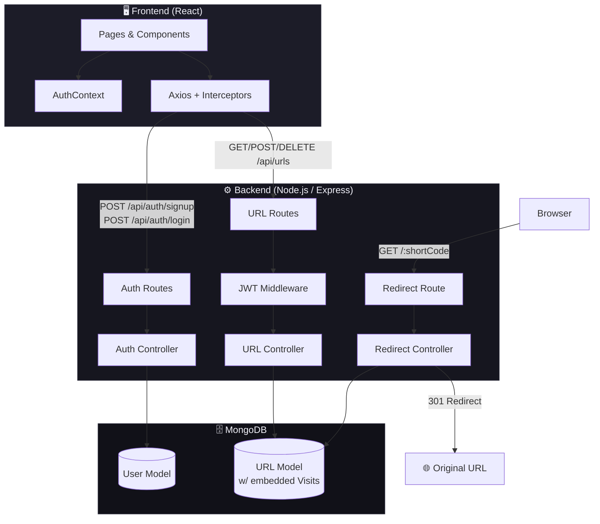

# Architecture Diagram



## Request Flow Diagrams

### User Login Flow
```
Browser → POST /api/auth/login
         → Validate input
         → Find user by email
         → bcrypt.compare(password, hash)
         → Sign JWT (7d)
         → Return { token, user }
         → Frontend stores token in localStorage
         → AuthContext updates state
         → Redirect to /dashboard
```

### URL Shortening Flow
```
Dashboard → POST /api/urls { originalUrl, customAlias? }
          → JWT verified by middleware
          → Validate URL with valid-url
          → Generate nanoid(7) or use customAlias
          → Check uniqueness in MongoDB
          → Save Url document
          → Return { url } with shortCode
          → Frontend prepends to URLs list
```

### Redirect & Analytics Flow
```
Browser → GET /:shortCode
        → Redirect Controller
        → Find URL by shortCode where isActive=true
        → Append visit { ip, userAgent, referrer, timestamp }
        → Increment clickCount, update lastVisited
        → Save document
        → 301 Redirect → originalUrl
```
